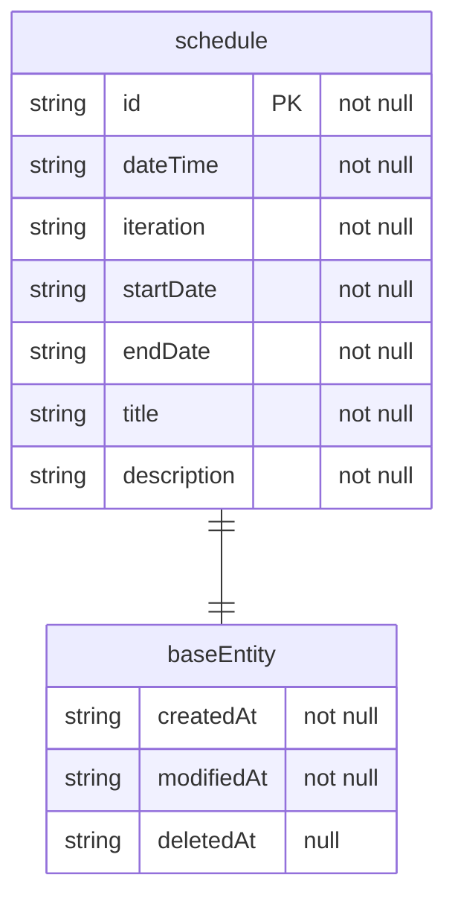

# app-push-server

오늘의 증시 일정을 알려주는 앱 푸시 알림 서버입니다.

## 기술 스택

 

* Java 17
* Spring Boot 2.7

# DB document 구조



```mongodb-json
{
    "id" : "1",
    "dateTime" : "2023-11-01T00:00:00Z",
    "iteration" : "ONCE",
    "startDate" : "2023-10-23",
    "endDate" : "2099-12-23",
    "title": "FOMC 정례 회의",
    "description" : "FOMC 정례 회의(11/01 ~ 11/02, 현지 시간 10/31 ~ 11/01)",
    "androidConfigs" : {
    },
    "apnConfigs" : {
    },
    "webPushConfigs" : {
    },
    "createdAt" : "2023-10-23T00:00:00Z",
    "modifiedAt" : "2023-10-23T00:00:00Z",
    "deleted_At" : null
}
```
